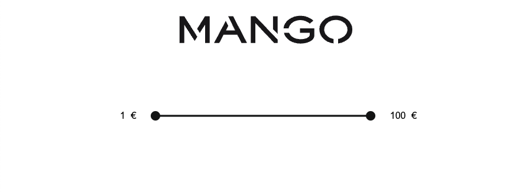
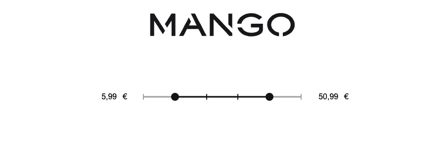

# MANGO WEB CHALLENGE

Component Range that allows to select a minimum and a maximum value freely or in fixed amounts for the Mango Front-end coding challenge by David Caro Gallego.

## Installation

The project has been developed with NodeJS v20.11.1

Use pnpm package manager to install the necessary dependencies.

```bash
pnpm install
```

## Scripts

Run the application in development mode

```bash
pnpm run dev
```

Generate a production build

```bash
pnpm run build
```

Locally preview the production build

```bash
pnpm run start
```

## Coding challenge Requirements

The test consists of creating a Range component that allows the selection of a minimum and a maximum value. The component has 2 variants:
- **Basic range**: Given minimum and maximum limits, it is possible to select any value in between.
- **Fixed value range**: Only specific values can be selected.

The values can be selected by using numeric input fields or by dragging small bullets. In both variants, the limit values are obtained from an API request.<br/>
In addition, it is required to implement unit tests to check the correct behavior of the component.

## Dependencies

- [NextJs](https://nextjs.org), the React framework used to build the application.
- [Jest](https://jestjs.io) + [React Testing Library](https://testing-library.com/docs/react-testing-library/intro) to write and run the unit tests.
- [TypeScript](https://www.typescriptlang.org) to add static typing to the project.

## Result



